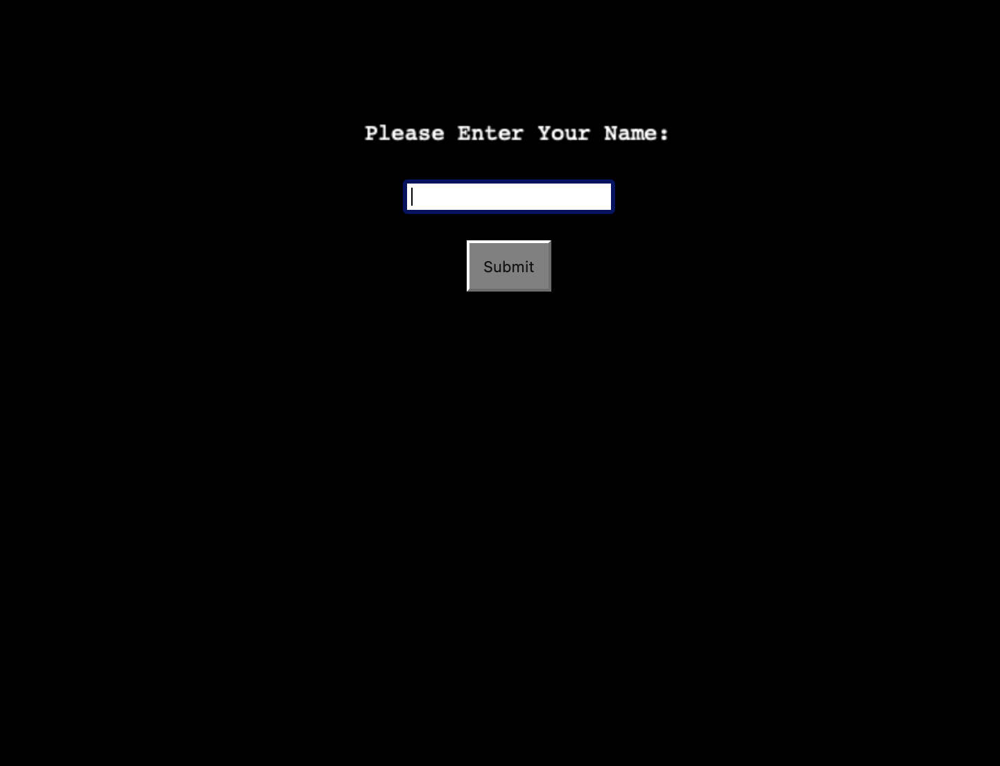
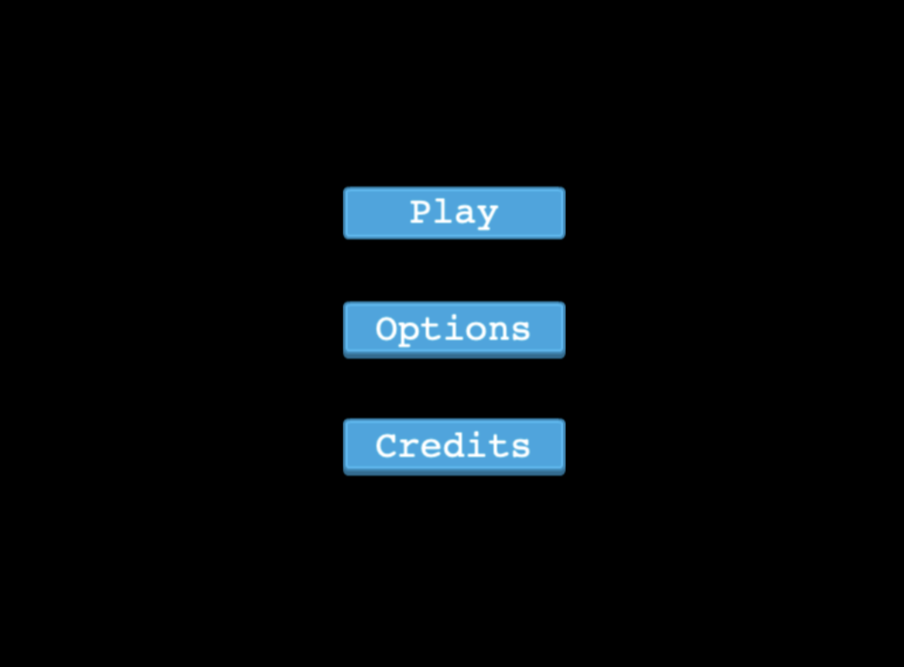
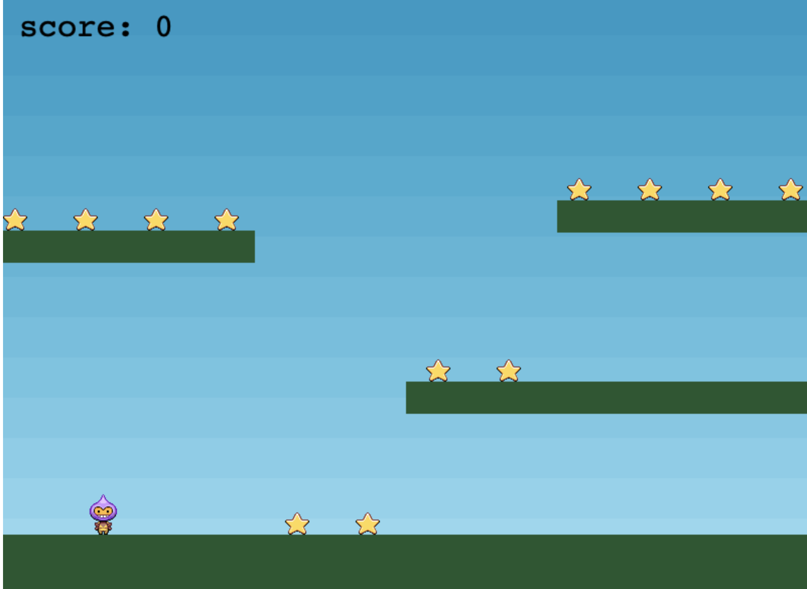

# RPG-game
PG game - Javascript capstone project by Microverse (created by Sayyod Saidov) [solo project]

# Table of Contents

* [About the Project](#about-the-project)
* [Built With](#built-with)
* [Live Demo](#live-demo)
* [Getting Started](#getting-started)
* [Prerequisites](#prerequisites)
* [Setup](#setup)
* [Author](#author)
* [Contributing](#contributing)
* [Show your support](#show-your-support)
* [License](#license)
* [Acknowledgements](#acknowledgements)

## About the Game

In this game you are expected to collect more stars as you can. You'll be given 10 points for every collected stars. When you collect all stars in the screen, new stars will appear and one bomb will be added. Every time you collect whole stars, more and more bombs joins to the game. The game ends when bombs hit the player.

Gameplay is extremely simple. To move around use arrow keys (" ↑ " - Jump, " → " - Move right, " ← " - Move left) as usual. Try to get as much point as you can, before the any bomb welcomes you)))

Good Luck!

## Built with

* [JavaScript](https://en.wikipedia.org/wiki/JavaScript)
* [Phaser 3](https://phaser.io/phaser3)
* [Webpack](https://webpack.js.org/)
* [Eslint](https://eslint.org/)
* [Babel](https://babeljs.io/)
* [Jest](https://jestjs.io/)
* [Github](https://github.com)
* [Netlify](https://app.netlify.com/) for the deployment

## Live-Demo

[RPG-Game](https://collect-stars.netlify.app/)

## Getting Started:

**How to play**

1. Click [here](https://collect-stars.netlify.app/)
  **OR**
   Download the zip file or clone from the git [here](https://github.com/MrSayyod/RPG-game)
   **OR** 
   Get this repo in your local machine by downloading this project or typing:
`
  git clone https://github.com/MrSayyod/RPG-game
`
   
**Scene-title:**
First, you have to enter your name which will be used to list on leaderboard scene:

After entering the username Title Scene opens:

  Here player can choose three options: Play, Options and Credits.
1. Play: Leads to game screen. 
2. Options: Turn on/off background music or sounds.
3. Credits: Credits to creator.

**Scene-main:**

1. Player can see a character/avatar on the screen and the stars.
2. Player moves to the right, left and jumps to collect stars.
3. After collecting all stars, new stars and one bomb will appear. BOmb quantity increases into 1 when all stars are collected.
4. The game ends if any bomb hits the player.

## Prerequisites:

  - Browser (preferably: Google Chrome)
  - Text editor (preferably: VSCode, Atom, Sublime)
  - Command line

## Setup

**To get this project set up on your local machine, follow these simple steps:**

  1. Clone the project into your local machine using `git clone` command or downloa the zip file.
  2. Go into the project directory using `cd directory name` command.
  3. Run `npm install`.
  3. Run `npm start`.
  4. Open in your browser 'localhost:8080'.

**For running the test cases:**
  1. Run "npm run test".

**Now You can start playing and enjoy.**

# Author

## :man_technologist: **Sayyod Saidov**

- Email: ssayyod@gmail.com
- Github: [@MrSayyod](https://github.com/MrSayyod) 
- LinkedIn:  [Sayyod Saidov](https://www.linkedin.com/in/sayyod-saidov-507b0818b)
- Twitter: [Sayyod Saidov](https://twitter.com/sayyodsaidov)
- Facebook: [Sayyod Saidov](https://www.facebook.com/sayyod)

## Contributing

:handshake: Contributions, issues, and feature requests are welcome!
Feel free to check the [issues page](hhttps://github.com/MrSayyod/RPG-game/issues).

1. Fork the Project
2. Create your Feature Branch (`git checkout -b feature/AmazingFeature`)
3. Commit your Changes (`git commit -m 'Add some AmazingFeature'`)
4. Push to the Branch (`git push origin feature/AmazingFeature`)
5. Open a Pull Request

## Show your support

Give a :star2: if you like this project!
## License

This project is [MIT](./LICENSE) licensed.
## Acknowledgements
* [Microverse](https://www.microverse.org/)
* [MDN Web docs](https://developer.mozilla.org/)
* [Phaser3](https://phaser.io/phaser3)
* [Netlify](https://app.netlify.com/) for the deployment
